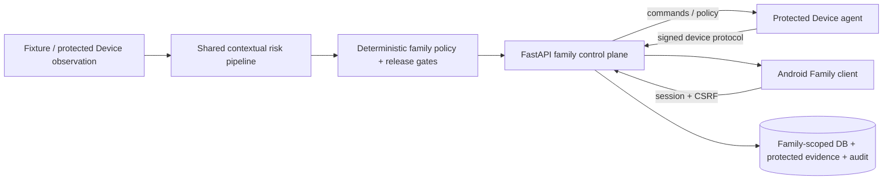

# Guardian — Android Mobile Port

Guardian is a contextual digital-safety and digital-literacy MVP for families. This branch maintains a native Android family interface on top of the current shared Guardian backend and protected-device protocol.

> **Branch model**
>
> - `main` is the source of truth for shared backend, risk, security, identity, data, and host-agent work.
> - `agent/android-mobile-port` periodically merges `main` and adapts its contracts to Android.
> - The Android application is a **Family/Membership client**, not the protected Device agent.
> - Protected Devices have their own identity and signed credential protocol.

The mobile app is native **Kotlin + Jetpack Compose**. It does not use a WebView, does not duplicate the Python risk engine, and never receives provider credentials such as `OPENAI_API_KEY`.

## Current architecture



The important security boundary is:

```text
Android Family UI                    Protected Device agent
      │                                      │
      │ cookie session + CSRF                │ signed credential
      ▼                                      ▼
                    Guardian API
                         │
                         ▼
        risk + calibration + policy + data controls
```

Android renders family-scoped state and performs explicit family actions. Observation, classifier/provider selection, calibration, enforcement, and protected-device credentials stay outside the parent app.

---

## What this branch inherits from current `main`

The branch includes the current shared implementation, including:

- Account / Family / Membership / Child / Device tenancy model;
- authenticated family sessions with CSRF protection;
- explicit local-only demo scope;
- one-time Device pairing challenges;
- per-Device credentials and signed Device API requests;
- credential rotation and revocation;
- Family-scoped incidents, policies, reports, evidence, and commands;
- request replay protection and Device protocol versioning;
- API rate limiting;
- protected evidence storage and access grants;
- audit trail and data-lifecycle controls;
- SQLite local development and managed-database production configuration;
- contextual R3 risk pipeline, calibration, kill switches, regression gates, and shadow evaluation;
- adaptive macOS observer, durable agent state, offline outbox, diagnostics, and command recovery;
- Swift ScreenCaptureKit/Vision helper and macOS packaging/E2E tests.

These shared files should track `main` unless the Android integration genuinely requires an adaptation.

---

## Android-specific adaptations

### Family authentication

Normal Android use now follows the R2 family-auth model:

1. the adult enters an Account email/password;
2. an optional `family_id` disambiguates accounts belonging to more than one Family;
3. the API issues `guardian_session` and `guardian_csrf` cookies;
4. the Android client keeps those values **in memory only**;
5. mutation requests send `X-CSRF-Token`;
6. a `401` clears the in-memory session and returns to login.

The app does not persist passwords or server session cookies in `SharedPreferences`.

### Family scope and Child selection

The Android app explicitly stores the selected `Child ID`. Incident, report, and policy requests are evaluated inside the authenticated Family scope; a resource identifier never expands that scope.

### Device pairing

The Android family app no longer pretends to be the protected Device.

It can issue a one-time pairing challenge through:

```http
POST /api/pairing/challenges
```

The UI displays the short pairing code. A real protected Device separately generates its key material and completes `/api/device/pair`, receiving its own credential. The protected Device then uses the signed `/api/agent/*` protocol.

### Explicit local demo mode

The synthetic demo is intentionally separate from normal authentication:

- server must start with `GUARDIAN_DEMO_MODE=true`;
- Android demo mode sends `X-Guardian-Demo: true`;
- the API accepts that header only on local transport;
- the host fixture client also sends the header only when `GUARDIAN_DEMO_MODE` is explicitly enabled;
- demo identity is forbidden in staging/production.

For Android, the recommended local path uses **ADB reverse** so the request still reaches the host API through loopback.

---

## Android permission boundary

The Android manifest requests only:

```text
android.permission.INTERNET
```

This family app does **not** request or implement:

- Accessibility Service access;
- MediaProjection / continuous screen capture;
- microphone access;
- camera access;
- Notification Listener access;
- Device Administrator / Device Owner control;
- real Android application blocking;
- protected-device signing credentials.

A future Android protected-device agent would require a separate architecture decision, permission model, consent/revocation flow, Play-policy review, tamper-resistance design, and release gate.

---

## Repository layout

```text
guardian/
├── android-app/      native Kotlin + Compose Family client
├── agent/            protected-device/host agent runtime
├── api/              FastAPI auth, tenancy, data security and control plane
├── guardian_core/    domain contracts, identity, device protocol and policy
├── risk_engine/      contextual risk pipeline, providers, calibration and shadow logic
├── evals/            synthetic dataset, regression gates and reports
├── fixtures/         deterministic demo scenarios
├── config/           environment and risk-control configuration
├── native/           macOS ScreenCaptureKit/Vision helper
├── packaging/        macOS packaging assets
├── docs/             ADRs, risk/security/data docs and runbooks
├── web/              browser family UI + synthetic demo chat
├── tests/            shared, security, identity, data, risk and host tests
└── scripts/          bootstrap, checks, demos and packaging helpers
```

Mobile-specific references:

- [`android-app/README.md`](android-app/README.md)
- [`docs/adr/0005-android-mobile-client.md`](docs/adr/0005-android-mobile-client.md)
- [`docs/product/mobile-demo-runbook.md`](docs/product/mobile-demo-runbook.md)

---

## Android specifications

| Item | Specification |
|---|---|
| Application ID | `com.guardian.mobile` |
| App version | `0.1.0` (`versionCode = 1`) |
| Language | Kotlin `2.3.21` |
| UI | Jetpack Compose + Material 3 |
| Compose BOM | `2026.06.00` |
| Activity Compose | `1.10.1` |
| Android Gradle Plugin | `8.13.2` |
| Gradle used by Android CI | `8.13` |
| Java / JVM target | Java 17 |
| `compileSdk` | 36 |
| `targetSdk` | 36 |
| `minSdk` | 26 |
| Debug transport | cleartext HTTP allowed for local development |
| Release transport | cleartext disabled; use HTTPS |
| Android permissions | `INTERNET` only |

The repository currently has no Gradle wrapper, so command-line builds require a compatible `gradle` executable. Android Studio can import the root project directly.

---

## Dependencies

### Backend

- Python 3.11+
- TCP port `8000` for the local demo
- packages in `requirements.txt`, including:
  - `fastapi>=0.115,<1`
  - `uvicorn[standard]>=0.34,<1`
  - `pydantic>=2.10,<3`
  - `pillow>=11,<13`
  - `psutil>=7,<8`
  - `cryptography>=46,<51`
  - pytest / Ruff development dependencies

### Android

- JDK 17
- Android SDK Platform 36
- Android SDK build/platform tools required by AGP
- Gradle 8.13 for CLI builds, or compatible Android Studio
- ADB for the recommended local demo transport

### Full repository checks

- Node.js 22
- pnpm 11

### Optional host capabilities

- `OPENAI_API_KEY` only for optional remote classifier paths;
- macOS 14+ and Swift 6 for the native ScreenCaptureKit/Vision helper.

The deterministic mobile demo needs **no OpenAI key, cloud service, real child data, elevated Android permission, or real enforcement**.

---

# Recommended local Android demo

The R2 security model intentionally restricts synthetic demo identity to local development. Use the dedicated mobile launchers below.

## 1. Check out the branch

```bash
git fetch origin
git switch agent/android-mobile-port
git pull
```

## 2. Bootstrap

macOS / Linux:

```bash
bash scripts/bootstrap.sh
```

Windows PowerShell:

```powershell
.\scripts\bootstrap.ps1
```

Optionally verify the current risk gate:

```bash
.venv/bin/python scripts/run_r3_evals.py --check
```

## 3. Reset previous demo state

Stop any running Guardian API first.

macOS / Linux:

```bash
bash scripts/reset-demo.sh
```

Windows:

```powershell
.\scripts\reset-demo.ps1
```

## 4. Start the demo API in explicit demo mode

Terminal 1, macOS / Linux:

```bash
bash scripts/run-mobile-demo-api.sh
```

Windows:

```powershell
.\scripts\run-mobile-demo-api.ps1
```

The launcher sets:

```text
GUARDIAN_ENVIRONMENT=development
GUARDIAN_DEMO_MODE=true
GUARDIAN_API_URL=http://127.0.0.1:8000
```

and binds FastAPI only to `127.0.0.1:8000`.

## 5. Forward Android localhost to host localhost

With the emulator or USB-connected Android device available:

```bash
adb reverse tcp:8000 tcp:8000
```

The Android app therefore uses:

```text
http://127.0.0.1:8000
```

This is deliberate: it preserves the backend's loopback-only demo boundary. Do **not** replace the demo flow with an exposed LAN server.

## 6. Build and run Android

Android Studio:

1. open the repository root;
2. sync Gradle;
3. configure JDK 17 and Android SDK 36;
4. select `android-app`;
5. select the emulator/device;
6. run the app.

Command line:

```bash
gradle :android-app:assembleDebug
```

Example APK install:

```bash
adb install -r android-app/build/outputs/apk/debug/android-app-debug.apk
```

## 7. Enable demo mode in the app

Open **Configuração** and set:

```text
API URL: http://127.0.0.1:8000
Modo de demonstração local: ON
Child ID: child-demo
```

Select **Usar Device demo** when needed. The app then requests the synthetic `family-demo` scope with the explicit demo header.

No email/password is needed in this mode.

## 8. Trigger the fixture

Terminal 2, macOS / Linux:

```bash
bash scripts/run-mobile-demo.sh
```

Windows:

```powershell
.\scripts\run-mobile-demo.ps1
```

The fixture launcher also enables `GUARDIAN_DEMO_MODE=true`, so its legacy demo endpoints carry the same explicit local demo scope.

Expected flow:

```text
dangerous_contact fixture
        ↓
shared contextual risk + family policy
        ↓
family-demo incident on device-demo
        ↓
Android Family review
        ↓
unlock / keep blocked
        ↓
host demo-agent command acknowledgement
```

If you unlock, Terminal 2 should eventually print something like:

```text
unlocked=Guardian Demo Chat command=<id>
```

## 9. Finish/reset

Turn demo mode off in Android when finished. Stop the API and run the reset script before a clean rehearsal.

---

# Normal authenticated mode

Normal mode does **not** use the demo header.

Requirements:

- a Guardian server reachable over HTTPS for non-local use;
- an existing Account with an active Membership in a Family;
- the relevant `Child ID` inside that Family.

In Android:

1. disable **Modo de demonstração local**;
2. configure the real API URL;
3. open **Entrar**;
4. enter email/password;
5. optionally provide `family_id` when the Account belongs to multiple Families;
6. configure the protected `Child ID`.

The server session and CSRF token are retained only while the Android process is alive. Credentials are not written to app preferences.

### Pairing a protected Device

From an authenticated Android family session:

1. open **Configuração**;
2. choose **Criar código de pareamento**;
3. give the short-lived code to the protected Device enrollment flow;
4. the Device generates its own key material and calls `/api/device/pair`;
5. the Device stores its issued credential and subsequently uses signed `/api/agent/*` requests.

The Android Family app never receives the Device secret.

---

## API roles used by Android

### Public/bootstrap

| Route | Use |
|---|---|
| `GET /api/health` | connectivity |
| `GET /api/capabilities` | capability disclosure |
| `POST /api/auth/login` | Account/Membership login |
| `GET /api/auth/session` | current Family scope |
| `POST /api/auth/logout` | end current session |

### Authenticated Family scope

| Route | Mobile use |
|---|---|
| `GET /api/devices/:id` | protected Device status |
| `POST /api/pairing/challenges` | issue one-time Device pairing code |
| `GET /api/incidents?child_id=...` | family dashboard |
| `GET /api/incidents/:id` | incident review |
| `POST /api/incidents/:id/unlock` | family unlock decision |
| `POST /api/incidents/:id/keep-blocked` | maintain block |
| `GET /api/daily-report?child_id=...` | daily report |
| `GET /api/children/:id/policy` | read policy |
| `PUT /api/children/:id/policy` | update policy |

Protected-device `/api/agent/*` routes are intentionally **not** implemented in the Android family client.

---

## Security and privacy notes

- Family authorization is session-derived; Android cannot expand scope by changing a `family_id` query parameter.
- Normal mutations use CSRF protection.
- Demo identity requires explicit server configuration, explicit client header, development/test environment, and local transport.
- Staging/production forbid demo mode.
- Protected Devices use distinct credentials and signed requests; family sessions are not Device credentials.
- Android stores API URL, demo toggle, selected Child ID, and last resolved Device ID as non-secret preferences; authentication cookies/passwords are not persisted.
- Release builds reject cleartext transport.
- Provider credentials stay on the host/backend.
- Android still has no observation or enforcement permission.

This remains an MVP, not a production-compliance claim. Real use with minors requires the broader retention, consent, deletion, authorization, incident-response, and regulatory controls documented in the shared project.
