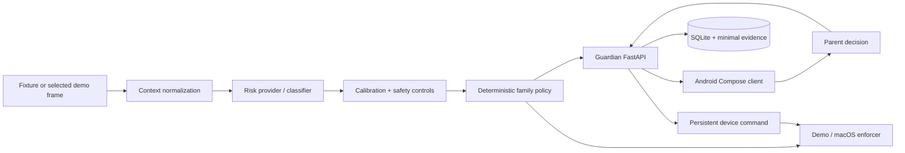

# Guardian — Android Mobile Port

Guardian is a contextual digital-safety and digital-literacy MVP for children and teenagers. It evaluates recent context, separates risk classification from deterministic family policy, stores minimal incident evidence, and keeps the final unlock decision with a parent or guardian.

> **Branch status**
>
> - `main` remains the primary desktop/web development branch.
> - `agent/android-mobile-port` is the maintained Android port.
> - This branch periodically merges `main` and adapts upstream product/backend changes to the mobile client without moving safety logic into Kotlin.

The Android app is a native **Kotlin + Jetpack Compose** client. The Python backend remains the source of truth for risk assessment, calibration, policy, incidents, evidence, telemetry, device commands, evaluation, and shadow-mode controls.

The Android app does **not** use a WebView and does **not** call OpenAI directly.

---

## Current architecture



The important boundary is:

```text
Android UI / device registration
            ↓
        Guardian API
            ↓
shared Python context + risk + calibration + policy pipeline
```

This prevents the mobile port from becoming a second safety implementation with different classification or enforcement behavior.

---

## What changed after the latest `main` sync

The mobile branch now includes the current upstream risk and demo work from `main`:

- normalized contextual risk contracts and provider descriptors;
- category-specific confidence calibration;
- configurable risk controls, thresholds, kill switches, and block approvals;
- a versioned OpenAI multimodal provider for the optional one-shot demo;
- a contextual risk pipeline with provider fallback/error handling;
- frozen evaluation data and regression gates;
- shadow-mode window aggregation and generated reports;
- R3 evaluation checks in CI and local quality scripts;
- the controlled `/demo-chat` experience;
- `scripts/run-live-demo.sh` and the optional macOS screenshot path;
- additional live-demo, OpenAI, pipeline, calibration, evaluation, and shadow tests;
- the upstream local demo runbook under `docs/product/demo-runbook.md`.

### Mobile adaptation of those changes

- The Android app remains a **review/control-plane client**. Risk providers, calibration, OpenAI requests, policy evaluation, and release gates stay in Python.
- The deterministic fixture flow remains the recommended cross-platform Android demo.
- Incidents created by the optional one-shot visual demo are compatible with the Android incident screen because the client already consumes the same incident contract and carries `screenshot_urls`.
- Android does not perform the macOS screen capture used by `live-demo`.
- Android does not gain Accessibility, MediaProjection, notification-listener, device-admin, microphone, or camera permissions as part of this sync.
- Real Android observation/enforcement remains a separate future architecture/release-gate decision.

For the mobile-specific presentation path, see [`docs/product/mobile-demo-runbook.md`](docs/product/mobile-demo-runbook.md).

---

## Repository layout

```text
guardian/
├── android-app/      native Kotlin + Jetpack Compose client
├── agent/            host-side agent, observer, API client and enforcer
├── api/              FastAPI control plane and SQLite persistence
├── guardian_core/    shared models, policy engine and runtime gates
├── risk_engine/      classifier, context, providers, calibration, eval + shadow pipeline
├── config/           environment examples and risk controls
├── evals/            frozen datasets, gates and generated R3 results
├── fixtures/         deterministic reproducible demo scenarios
├── docs/             ADRs, runbooks, privacy, security and release gates
├── web/              browser dashboard + controlled demo chat
├── tests/            backend, risk, live-demo and safety regression tests
├── scripts/          bootstrap, checks, demos, evaluation and reset commands
├── build.gradle.kts  Android plugin/toolchain versions
└── settings.gradle.kts
```

The Android architectural decision is documented in [`docs/adr/0005-android-mobile-client.md`](docs/adr/0005-android-mobile-client.md).

---

# Android application

## Implemented mobile flows

- Parent dashboard with daily usage and incident metrics.
- Incident list and incident review.
- Parent **unlock** and **keep blocked** actions.
- Child transparency view with daily aggregated app use.
- Family policy editor for `ALLOW`, `ALERT`, and `BLOCK` actions.
- Guardian API connection configuration.
- Android device pairing through `POST /api/devices/pair`.
- Capability-aware UI backed by `/api/capabilities`.
- Support for incident records that include visual-evidence URLs.
- Independent Android CI build.

## Deliberately not implemented on Android

The Android manifest requests only:

```text
android.permission.INTERNET
```

This port does not currently request or implement:

- Accessibility Service access;
- MediaProjection or continuous screen capture;
- microphone access;
- camera access;
- Notification Listener access;
- Device Administrator / Device Owner control;
- real Android application blocking.

That is intentional. Any real Android observation or enforcement must have its own permission model, consent/revocation path, package denylist, Android/Play-policy review, privacy/threat-model update, and release gate.

---

## Android specifications

| Item | Specification |
|---|---|
| Application ID | `com.guardian.mobile` |
| App version | `0.1.0` (`versionCode = 1`) |
| Language | Kotlin `2.3.21` |
| UI | Jetpack Compose + Material 3 |
| Compose BOM | `2026.06.00` |
| Activity Compose | `1.10.1` |
| Android Gradle Plugin | `8.13.2` |
| Gradle used by CI | `8.13` |
| Java / JVM target | Java 17 |
| `compileSdk` | 36 |
| `targetSdk` | 36 |
| `minSdk` | 26 |
| Debug transport | Local cleartext HTTP permitted |
| Release transport | Cleartext disabled; use HTTPS |
| Android permissions | `INTERNET` only |

The repository does not currently include a Gradle wrapper. Command-line Android builds therefore expect a compatible `gradle` executable; Android Studio can import the root project directly.

---

# Backend and risk-pipeline dependencies

## Required for the deterministic local demo

- Python 3.11+
- Port `8000` available locally
- Python dependencies from `requirements.txt` / `pyproject.toml`, including:
  - `fastapi>=0.115,<1`
  - `uvicorn[standard]>=0.34,<1`
  - `pydantic>=2.10,<3`
- Android Studio or an Android SDK/JDK/Gradle setup matching the Android specifications above

No OpenAI key, cloud database, remote authentication service, or external content is required for the deterministic fixture demo.

## Required for all repository quality checks

The complete `scripts/check.sh` path also uses:

- pytest;
- Ruff;
- Node.js 22;
- pnpm 11.

It runs Stage 0 validation, the frozen R3 regression/shadow checks, Python lint/format/tests, and browser JavaScript checks.

## Optional OpenAI live-demo dependency

The optional host-side one-shot visual demo uses the OpenAI Responses API through `risk_engine/openai.py`.

It requires:

```bash
export OPENAI_API_KEY="..."
```

The current default model is configured in the Python provider. The Android application never receives or stores this key and never calls OpenAI directly.

The optional live demo is currently macOS-specific because capture uses the macOS observer. The deterministic fixture path remains the official portable fallback.

---

# Recommended local Android demo

This is the most reproducible path and requires no invasive Android permissions or OpenAI credentials.

## 1. Check out the mobile branch

```bash
git fetch origin
git switch agent/android-mobile-port
git pull
```

For a fresh clone:

```bash
git clone --branch agent/android-mobile-port https://github.com/luqhe/Hackaton-OpenAI-2026.git
cd Hackaton-OpenAI-2026
```

## 2. Bootstrap the backend

### macOS / Linux

```bash
bash scripts/bootstrap.sh
```

### Windows PowerShell

```powershell
.\scripts\bootstrap.ps1
```

This creates `.venv` and installs the Python dependencies.

## 3. Optional: run the risk regression gate

For the R3 risk/evaluation checks only:

```bash
.venv/bin/python scripts/run_r3_evals.py --check
```

For the complete repository checks on macOS/Linux, after installing the Node/pnpm dependencies:

```bash
pnpm install
bash scripts/check.sh
```

## 4. Start the Guardian API

In terminal 1:

### macOS / Linux

```bash
bash scripts/run-api.sh
```

### Windows PowerShell

```powershell
.\scripts\run-api.ps1
```

The standard script listens on:

```text
http://127.0.0.1:8000
```

Useful host-side endpoints:

- Guardian browser/debug UI: `http://127.0.0.1:8000`
- Controlled demo chat: `http://127.0.0.1:8000/demo-chat`
- OpenAPI: `http://127.0.0.1:8000/docs`
- Health: `http://127.0.0.1:8000/api/health`

## 5. Start an Android Emulator

The mobile app defaults to:

```text
http://10.0.2.2:8000
```

`10.0.2.2` is the Android Emulator alias for the development computer's loopback interface, so it reaches the API listening on `127.0.0.1:8000`.

## 6. Build and run Android

### Android Studio

1. Open the **repository root**.
2. Complete Gradle sync.
3. Configure JDK 17 and Android SDK Platform 36.
4. Select the `android-app` application module.
5. Select the running emulator.
6. Run the app.

### Command line

With JDK 17, Android SDK 36 and Gradle 8.13 configured:

```bash
gradle :android-app:assembleDebug
```

The debug APK is produced under:

```text
android-app/build/outputs/apk/debug/
```

A typical ADB install command is:

```bash
adb install -r android-app/build/outputs/apk/debug/android-app-debug.apk
```

## 7. Confirm connection

In Guardian Android, open **Conexão** and verify:

```text
http://10.0.2.2:8000
```

Use the connection check.

For the standard canned demo, keep the app on:

```text
device-demo
```

The fixture launcher also targets `device-demo`, which lets the host-side demo agent and Android parent UI refer to the same incident/command stream.

**Parear este Android** is available for device-registration testing, but pairing does not enable Android observation or enforcement.

## 8. Trigger the deterministic controlled incident

In terminal 2:

### macOS / Linux

```bash
bash scripts/run-demo.sh
```

### Windows PowerShell

```powershell
.\scripts\run-demo.ps1
```

The agent will:

1. load `fixtures/dangerous_contact/session.json`;
2. classify the contextual progression of personal-information requests;
3. apply the deterministic family policy and runtime gate;
4. simulate the application block;
5. persist an incident and minimal evidence;
6. wait for the parent decision.

## 9. Complete the flow in Android

In the Android app:

1. open **Início**;
2. refresh the dashboard;
3. select the new incident;
4. review category, confidence, explanation, and evidence;
5. choose **Desbloquear aplicativo** or **Manter bloqueado**.

If you unlock, the backend creates an `UNLOCK_APPLICATION` command. Terminal 2 should eventually print something like:

```text
unlocked=Guardian Demo Chat command=<id>
```

That completes the mobile vertical slice:

```text
fixture
  ↓
shared risk + policy pipeline
  ↓
incident
  ↓
Android parent review
  ↓
unlock command
  ↓
host demo-agent acknowledgement
```

## 10. Reset the demo

Stop the API first.

### macOS / Linux

```bash
bash scripts/reset-demo.sh
```

### Windows PowerShell

```powershell
.\scripts\reset-demo.ps1
```

---

# Optional one-shot visual demo + Android review

The latest upstream `main` also provides an optional macOS live-demo launcher.

This does **not** make Android the observer. The host Mac captures one selected demo frame, classifies it, creates the same Guardian incident, and the Android app can then be used for parent review.

Requirements:

- macOS host;
- the Guardian API running locally;
- `OPENAI_API_KEY` for the actual OpenAI classification path;
- the macOS screen-capture permission required by the observer;
- controlled synthetic demo content.

Run:

```bash
bash scripts/run-live-demo.sh
```

The launcher is explicit about its source/mode and falls back to the deterministic fixture path when the optional live path cannot complete.

The host-side controlled chat is available at:

```text
http://127.0.0.1:8000/demo-chat
```

After an incident is created, refresh the Android dashboard and review it exactly like a fixture-generated incident.

See the upstream [`docs/product/demo-runbook.md`](docs/product/demo-runbook.md) for the host/browser presentation flow and [`docs/product/mobile-demo-runbook.md`](docs/product/mobile-demo-runbook.md) for the Android-adapted version.

---

# Running on a physical Android device

A physical phone cannot use `10.0.2.2` to reach the development computer.

Run FastAPI on an address reachable from the phone instead of using `scripts/run-api.sh`:

### macOS / Linux

```bash
.venv/bin/python -m uvicorn api.main:app --host 0.0.0.0 --port 8000 --reload
```

### Windows PowerShell

```powershell
.\.venv\Scripts\python.exe -m uvicorn api.main:app --host 0.0.0.0 --port 8000 --reload
```

Then configure **Conexão** with the development computer's LAN address, for example:

```text
http://192.168.1.50:8000
```

Make sure the phone and computer are on the same trusted network and that the host firewall allows TCP port `8000`.

Debug builds permit local HTTP. Use HTTPS for anything beyond trusted local development.

---

# Risk evaluation and controls

The synchronized branch includes the current R3 evaluation/control assets from `main`:

- `config/risk-controls.v1.json` — calibration curves, category thresholds, kill switches and block approvals;
- `evals/dataset-manifest.v1.json` — provenance/allowed-use metadata for the synthetic evaluation dataset;
- `evals/dataset-v1.jsonl` — development/calibration/test contexts;
- `evals/regression-gate.v1.json` — frozen regression criteria;
- `evals/results/` — current evaluation and shadow outputs;
- `scripts/run_r3_evals.py` — reproducible evaluation/check entry point.

Run:

```bash
.venv/bin/python scripts/run_r3_evals.py --check
```

These controls are backend concerns. Android displays the resulting incidents and policy state; it does not implement its own calibration or threshold logic.

---

# API used by Android

| Method and route | Mobile use |
|---|---|
| `GET /api/health` | Connection check |
| `GET /api/capabilities` | Server capability disclosure |
| `GET /api/devices/:id` | Device status |
| `POST /api/devices/pair` | Register an Android device |
| `GET /api/incidents` | Parent dashboard |
| `GET /api/incidents/:id` | Incident review |
| `POST /api/incidents/:id/request-unlock` | Child explanation/review request |
| `POST /api/incidents/:id/unlock` | Parent unlock decision |
| `POST /api/incidents/:id/keep-blocked` | Parent keeps the block |
| `GET /api/daily-report` | Parent/child daily summaries |
| `GET /api/children/:id/policy` | Read family policy |
| `PUT /api/children/:id/policy` | Update family policy |

The host-side agent additionally consumes:

| Method and route | Agent use |
|---|---|
| `POST /api/incidents` | Persist classified/policy-decided incident |
| `POST /api/incidents/:id/evidence` | Upload selected minimal evidence |
| `GET /api/devices/:id/commands` | Poll pending commands |
| `POST /api/devices/:id/commands/:commandId/ack` | Confirm command execution |
| `POST /api/devices/:id/telemetry` | Record aggregate telemetry |

---

# CI and validation

Two complementary workflows are kept on the mobile branch:

- `.github/workflows/ci.yml` — shared Python/web contracts, R3 risk regression, lint, format, and tests inherited from `main`;
- `.github/workflows/android.yml` — Android debug APK build for `main` / `agent/**` changes that touch the Android project.

Useful local checks:

```bash
.venv/bin/python scripts/validate_stage0.py
.venv/bin/python scripts/run_r3_evals.py --check
.venv/bin/python -m ruff check .
.venv/bin/python -m pytest
```

With browser tooling installed:

```bash
pnpm check:js
pnpm lint:js
pnpm format:check
```

Android:

```bash
gradle :android-app:assembleDebug
```

---

# Security and privacy boundaries

- `RiskAssessment` does not contain an enforcement action.
- Family policy and runtime release gates decide device actions after classification.
- Android does not receive provider/API credentials.
- OpenAI is optional and host-side only in the current mobile port.
- The deterministic fixture demo remains local and requires no external service.
- Remote/provider failures must not silently become new blocks.
- Evidence is incident-scoped and size/type constrained by the API.
- Debug cleartext transport exists only for local development; release Android builds disable it.
- Android observation and real enforcement remain disabled.
- No microphone or camera collection is enabled by this port.

This MVP is not production compliance. Deployment involving minors still requires authentication and authorization, family/tenant isolation, encryption and key management, retention/deletion guarantees, consent/guardian flows, LGPD/COPPA review, tamper resistance, auditability, notification design, and formal false-positive/false-negative evaluation.

---

# Known limitations

- Android currently acts as the native family UI/control client, not the observation/enforcement agent.
- The optional real screenshot demo is macOS-specific.
- The OpenAI provider is optional; the deterministic fixture path remains the reproducible baseline.
- Device pairing is registration only and does not activate Android collection.
- Authentication, push notifications, multiple families, and public deployment are not implemented.
- The current branch still uses polling for host device commands.

See also:

- [`docs/product/mobile-demo-runbook.md`](docs/product/mobile-demo-runbook.md)
- [`docs/product/demo-runbook.md`](docs/product/demo-runbook.md)
- [`docs/adr/0005-android-mobile-client.md`](docs/adr/0005-android-mobile-client.md)
- [`docs/product/release-gates.md`](docs/product/release-gates.md)
- [`docs/security/threat-model.md`](docs/security/threat-model.md)
- [`docs/privacy/data-map.md`](docs/privacy/data-map.md)
