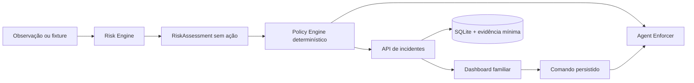

# Guardian

Guardian é um MVP de proteção contextual e letramento digital para crianças e adolescentes. Ele interpreta o contexto recente da atividade, aplica uma política familiar determinística, registra evidência mínima e devolve a decisão final de desbloqueio ao responsável.

Este repositório implementa um vertical slice executável e reproduzível:

```text
fixture de conversa → avaliação de risco → política familiar → bloqueio
→ incidente → explicação da criança → decisão do responsável → desbloqueio
```

O modo padrão **não controla o sistema operacional**. Ele simula o estado de bloqueio para que a demo seja segura em qualquer plataforma. O encerramento real de um aplicativo macOS é separado e precisa ser habilitado explicitamente.

## O que está implementado

- Risk engine com contratos validados e contexto temporal.
- Casos reproduzíveis de contato perigoso, conteúdo adulto, discurso de ódio e aula de biologia segura.
- Policy Engine determinístico; o classificador não escolhe a ação no dispositivo.
- FastAPI com SQLite, deduplicação, políticas, telemetria, incidentes e relatório diário.
- Upload de evidência limitado a 4 MB e servido sem cache público.
- Ciclo `BLOCKED → UNLOCK_REQUESTED → UNLOCKED | KEPT_BLOCKED`.
- Fila persistente de comandos e confirmação pelo agente.
- Dashboard responsivo do responsável, tela da criança e editor de políticas.
- Agente em modo de demo e adaptadores macOS mínimos.
- Helper Swift com ScreenCaptureKit, metadados de janela, OCR local com Vision e diagnóstico de permissões.
- Loop macOS adaptativo com hash perceptual, contexto efêmero, outbox offline e heartbeat de saúde.
- Estado de bloqueio/comandos recuperável após reinício e logs estruturados com redaction.
- Empacotamento de desenvolvimento, LaunchAgent e diagnóstico de CPU, memória, bateria, disco e rede.
- Testes automatizados do fluxo completo.
- Release gates executáveis que limitam bloqueio automático por ambiente.
- Configuração tipada para desenvolvimento, teste, staging e produção.
- CI, lint, formatação, threat model, mapa de dados, registro de riscos e ADRs.

## Arquitetura



```text
guardian/
├── agent/            agente, cliente HTTP, observer e enforcer
├── api/              aplicação FastAPI e persistência SQLite
├── guardian_core/    contratos compartilhados e Policy Engine
├── risk_engine/      avaliação contextual reproduzível
├── fixtures/         cenários controlados da demo
├── config/           exemplos seguros por ambiente
├── docs/             gates, segurança, privacidade e ADRs
├── web/              dashboard servido pela API
├── tests/            testes do risk engine, API e enforcement
└── scripts/          preparação e execução
```

O dashboard estático é servido pelo próprio FastAPI para retirar um segundo runtime do caminho crítico do hackathon. Next.js permanece uma opção pós-MVP quando houver autenticação, deploy independente e uma equipe dedicada ao frontend.

## Pré-requisitos

- Python 3.11 ou mais recente.
- macOS apenas para captura e enforcement reais.
- Portas locais disponíveis: `8000`.
- Node.js 22 e pnpm 11 somente para lint/formatação do frontend durante desenvolvimento.

Nenhuma conta, chave de API ou serviço remoto é necessário para a demo reproduzível.

## Instalação

### macOS ou Linux

```bash
bash scripts/bootstrap.sh
```

### Windows PowerShell

```powershell
.\scripts\bootstrap.ps1
```

Os scripts criam `.venv` e instalam as dependências declaradas em `requirements.txt`.

### Bundle de desenvolvimento macOS

Em um Mac de desenvolvimento:

```bash
bash scripts/package-macos.sh
bash scripts/install-macos-dev.sh
```

O primeiro comando cria `.dist/guardian-dev`; o segundo instala um LaunchAgent no perfil do usuário.
Consulte [docs/product/macos-permissions.md](docs/product/macos-permissions.md) antes de ativar a
observação. O helper nunca solicita câmera ou microfone.

## Demo completa

Abra dois terminais na raiz do projeto.

No primeiro, inicie a aplicação:

```bash
# macOS/Linux
bash scripts/run-api.sh
```

```powershell
# Windows
.\scripts\run-api.ps1
```

Acesse [http://127.0.0.1:8000](http://127.0.0.1:8000). A documentação interativa da API fica em [http://127.0.0.1:8000/docs](http://127.0.0.1:8000/docs).

No segundo terminal, execute o incidente controlado:

```bash
# macOS/Linux
bash scripts/run-demo.sh
```

```powershell
# Windows
.\scripts\run-demo.ps1
```

O agente irá:

1. Ler `fixtures/dangerous_contact/session.json`.
2. Detectar a progressão de pedidos pessoais.
3. Aplicar a política `DANGEROUS_CONTACT = BLOCK`.
4. Persistir o bloqueio simulado e criar um incidente.
5. Enviar a transcrição mínima como evidência.
6. Aguardar a decisão do responsável.

Na interface:

1. Abra o incidente na visão geral.
2. Opcionalmente abra a URL da criança mostrada pelo agente e envie uma explicação.
3. Escolha **Desbloquear aplicativo**.
4. Observe no terminal do agente a confirmação `unlocked=Guardian Demo Chat`.

Executar novamente a mesma fixture enquanto o incidente ainda está ativo não cria uma duplicata. Depois de um desbloqueio, uma nova execução cria uma nova rodada da demo.

Para começar novamente com banco e evidências vazios, pare a API e execute `bash scripts/reset-demo.sh` no macOS/Linux ou `.\scripts\reset-demo.ps1` no Windows. O script valida o alvo e remove somente `.data/`.

## Outros cenários

Com a API ativa:

```bash
.venv/bin/python -m agent.main demo --fixture fixtures/safe_biology/session.json
.venv/bin/python -m agent.main demo --fixture fixtures/adult_content/session.json
.venv/bin/python -m agent.main demo --fixture fixtures/hate_speech/session.json
```

No Windows, substitua `.venv/bin/python` por `.venv\Scripts\python.exe`.

O cenário `safe_biology` deve retornar `SAFE` sem criar incidente, demonstrando que terminologia sensível em contexto educacional não é bloqueada por palavra-chave isolada.

## Enforcement real no macOS

Use somente com um aplicativo descartável criado para a apresentação. O modo real é deny-by-default e se recusa a bloquear Finder, Terminal, Ajustes do Sistema e outros processos essenciais.

1. Defina a lista explícita:

   ```bash
   export GUARDIAN_REAL_ENFORCEMENT_ENABLED=true
   export GUARDIAN_BLOCKABLE_APPS="Guardian Demo Chat"
   ```

2. Execute:

   ```bash
   .venv/bin/python -m agent.main demo --real-enforcement --wait-for-unlock
   ```

3. Conceda as permissões solicitadas em **System Settings → Privacy & Security**:

   - Screen Recording, para captura real.
   - Accessibility ou Automation, somente se o fluxo escolhido usar `System Events`/AppleScript.

O observer real está em `agent/observer.py`. A fixture é o caminho oficial da demo porque elimina dependência de conteúdo externo e de permissões concedidas no último minuto.

### Observação contínua e diagnóstico

Com a API local ativa, permissões concedidas e `OPENAI_API_KEY` configurada:

```bash
.venv/bin/python -m agent.main observe
```

Telas visualmente estáticas são descartadas; o intervalo cresce durante inatividade. Falhas de
permissão pausam novas capturas e indisponibilidade da API enfileira incidentes e telemetria
localmente. Captura real nunca preserva `BLOCK` fora dos release gates aprovados.

Para coletar snapshots técnicos sem conteúdo observado:

```bash
.venv/bin/python -m agent.main diagnostics --samples 12 --interval 10
```

## Testes

```bash
# macOS/Linux
.venv/bin/python -m pytest
```

```powershell
# Windows
.\.venv\Scripts\python.exe -m pytest
```

Para instalar e executar todos os checks de desenvolvimento:

```bash
pnpm install
python scripts/validate_stage0.py
python -m ruff check .
python -m ruff format --check agent api guardian_core risk_engine scripts tests
python -m pytest
pnpm check:js
pnpm lint:js
pnpm format:check
```

Os testes cobrem classificação contextual segura e perigosa, release gates, configuração por ambiente, capacidades declaradas, versionamento de schema, deduplicação, evidência, contestação, desbloqueio, fila de comandos, telemetria e proteção contra bloqueio de aplicativo essencial.

## Rotas da interface

| Rota | Função |
|---|---|
| `/` | Dashboard do responsável |
| `/incidents/:id` | Explicação, evidências e decisão |
| `/child?incident=:id` | Aviso educativo e solicitação de revisão |
| `/child` | Relatório diário e transparência |
| `/settings` | Políticas familiares |
| `/docs` | OpenAPI interativa |

## API essencial

| Método e rota | Uso |
|---|---|
| `GET /api/health` | Saúde, ambiente e versões da aplicação/API |
| `GET /api/capabilities` | Capacidades realmente ativas nesta versão |
| `POST /api/incidents` | Agente registra avaliação e decisão |
| `POST /api/incidents/:id/evidence` | Envia evidência mínima em corpo bruto |
| `POST /api/incidents/:id/request-unlock` | Criança explica e solicita revisão |
| `POST /api/incidents/:id/unlock` | Responsável autoriza e cria comando |
| `POST /api/incidents/:id/keep-blocked` | Responsável mantém o bloqueio |
| `GET /api/devices/:id/commands` | Agente consulta comandos pendentes |
| `POST /api/devices/:id/commands/:commandId/ack` | Agente confirma execução |
| `POST /api/devices/:id/heartbeat` | Versão, permissões, fila e saúde real do agente |
| `GET /api/daily-report` | Agregação determinística do dia |
| `GET/PUT /api/children/:id/policy` | Consulta e altera políticas |
| `POST /api/devices/pair` | Pareia um dispositivo ao perfil demo |

## Configuração

As configurações podem ser fornecidas por variáveis de ambiente; `.env.example` documenta os valores.

| Variável | Padrão | Descrição |
|---|---|---|
| `GUARDIAN_ENVIRONMENT` | `development` | Ambiente tipado da aplicação |
| `GUARDIAN_API_URL` | `http://127.0.0.1:8000` | API consultada pelo agente |
| `GUARDIAN_DB_PATH` | `.data/guardian.db` | Banco SQLite local |
| `GUARDIAN_EVIDENCE_DIR` | `.data/evidence` | Evidências selecionadas |
| `GUARDIAN_LOG_LEVEL` | `INFO` | Nível de log sem conteúdo bruto |
| `GUARDIAN_AUTOMATIC_BLOCKING_ENABLED` | `true` na demo | Habilita bloqueio somente dentro dos gates |
| `GUARDIAN_REAL_ENFORCEMENT_ENABLED` | `false` | Segunda confirmação para enforcement macOS real |
| `GUARDIAN_RELEASE_GATE_APPROVED` | `false` | Gate obrigatório fora de desenvolvimento/teste |
| `GUARDIAN_BLOCKABLE_APPS` | `Guardian Demo Chat` | Allowlist do enforcement real |

Os dados de demonstração usam `child-demo` e `device-demo`. O banco, evidências e estado do agente ficam em `.data/`, ignorado pelo Git.

## Decisões de segurança e privacidade

- `RiskAssessment` não contém ação de enforcement.
- Avaliações `SAFE` não podem criar incidentes.
- Falha técnica é fail-open: gera erro/log, nunca um bloqueio novo.
- Bloqueio fora de fixtures locais sofre downgrade para `ALERT` sem release gate aprovado.
- Enforcement real exige flag e allowlist explícitas.
- Aplicativos essenciais possuem denylist interna.
- Evidências aceitam apenas PNG, JPEG, WebP ou texto, até 4 MB.
- Caminhos de evidência não são fornecidos pelo cliente e são validados antes da leitura.
- Conteúdo observado é dado não confiável; a heurística não executa instruções da tela.
- A demo não captura microfone nem câmera.

Este MVP não representa conformidade pronta para produção. Uso real com menores exige autenticação, autorização por família/dispositivo, criptografia, política de retenção e exclusão verificável, consentimento apropriado, revisão de LGPD/COPPA, auditoria, proteção contra adulteração e avaliação formal de falsos positivos.

## Limites conhecidos

- O risk engine de fixtures continua determinístico; captura controlada e o loop macOS usam o provider multimodal remoto.
- O helper Swift oferece ScreenCaptureKit e OCR Vision, mas a ponte versionada helper → agente (`R1-04`) permanece deliberadamente pendente.
- A sincronização usa polling local, suficiente para a demo.
- Não há autenticação, notificações push, múltiplas famílias ou deploy público.
- O hash atual é criptográfico; um perceptual hash deve substituí-lo antes de observação contínua.

O [ROADMAP.md](ROADMAP.md) acompanha a implementação até produção. O índice [docs/README.md](docs/README.md) reúne gates, threat model, mapa de dados, riscos, playbooks e decisões arquiteturais. O documento [guardian_hackathon_context.md](guardian_hackathon_context.md) preserva a visão completa do produto e o escopo original do hackathon.
