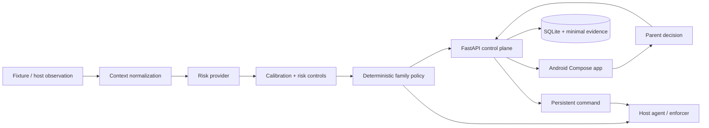

# Guardian — Android Mobile Port

Guardian is a contextual digital-safety and digital-literacy MVP for children and teenagers. It separates contextual risk assessment from deterministic family policy, stores minimal incident evidence, and keeps the final unlock decision with a parent or guardian.

> **This is the maintained mobile branch.**
>
> - `main` is the primary desktop/web + macOS-agent branch.
> - `agent/android-mobile-port` periodically merges `main` and adapts it to a native Android family interface.
> - Shared backend, risk, evaluation, and host-agent changes follow `main`.
> - Android-specific UI/build/permission decisions remain isolated on this branch.

The Android application is native **Kotlin + Jetpack Compose**. It is not a WebView, does not contain a second risk engine, and never receives provider credentials such as `OPENAI_API_KEY`.

## Mobile architecture



The safety boundary is deliberate:

```text
Android UI / Android device registration
                  ↓
              Guardian API
                  ↓
 shared Python context + risk + calibration + policy pipeline
```

Kotlin renders state and invokes explicit family actions. Classification, calibration, provider selection, release gates, and enforcement policy remain shared/backend concerns.

---

# What is included on this branch

## Native Android client

- Parent dashboard with daily usage and incident metrics.
- Incident list and incident-detail review.
- Parent **unlock** / **keep blocked** decisions.
- Child transparency view.
- Family policy editor for `ALLOW`, `ALERT`, and `BLOCK`.
- API connection configuration.
- Android device pairing through `POST /api/devices/pair`.
- Android heartbeat through `POST /api/devices/:id/heartbeat` for actually paired Android devices.
- Capability-aware UI backed by `/api/capabilities`.
- Compatibility with text evidence and incidents carrying visual-evidence URLs.
- Independent Android CI debug build.

### Android heartbeat adaptation

The latest shared API introduced agent/device heartbeats. Paired Android devices now use that endpoint to keep `last_seen_at` meaningful.

The Android heartbeat reports the current mobile boundary truthfully:

```text
screen_recording_permission = false
accessibility_permission    = false
observer_healthy            = false
offline_queue_depth         = 0
```

The app does **not** send an Android heartbeat for the legacy `device-demo` record because that record represents the host-side demo device.

## Current shared R3 risk stack from `main`

The branch now contains the current upstream contextual-risk work, including:

- normalized context contracts and provider descriptors;
- local and optional OpenAI providers;
- category-specific confidence calibration;
- configurable thresholds, kill switches, and block approvals;
- provider timeout/retry/fallback controls;
- frozen synthetic evaluation datasets and regression gates;
- shadow-mode windows, summaries, and static dashboard;
- annotation/contextual-pipeline documentation;
- R3 checks integrated into CI and local quality scripts.

The optional OpenAI provider remains Python/host-side. Android never stores or transmits the OpenAI key.

## Current host-agent hardening from `main`

The rebuilt branch also inherits the latest desktop/macOS runtime work:

- adaptive observation scheduling;
- temporal context buffering;
- perceptual-change detection and ephemeral capture handling;
- durable agent state and command recovery;
- offline outbox/retry behavior;
- device heartbeat and health state;
- structured logs with redaction;
- CPU, memory, battery, disk, and network diagnostics;
- hardened macOS observer and enforcer;
- native Swift ScreenCaptureKit/Vision helper;
- macOS development packaging + LaunchAgent scripts;
- macOS E2E workflow and resilience tests.

These are **host/macOS capabilities**. Their presence in the repository does not imply Android screen observation, Accessibility access, OCR, or enforcement.

---

# Android permission boundary

The Android manifest requests only:

```text
android.permission.INTERNET
```

The mobile port does **not** currently request or implement:

- Accessibility Service access;
- MediaProjection / continuous screen capture;
- microphone access;
- camera access;
- Notification Listener access;
- Device Administrator / Device Owner control;
- real Android application blocking.

Real Android observation/enforcement requires a separate architecture decision and release gate covering consent/revocation, Android management model, protected-package deny rules, tamper resistance, Play-policy implications, privacy/security review, and false-positive handling.

---

# Repository layout

```text
guardian/
├── android-app/      native Kotlin + Jetpack Compose family client
├── agent/            host agent, context, scheduler, outbox, diagnostics, observer/enforcer
├── api/              FastAPI control plane and SQLite persistence
├── guardian_core/    shared contracts, policy engine and runtime gates
├── risk_engine/      context, providers, calibration, pipeline, eval + shadow logic
├── evals/            synthetic dataset, frozen gates and versioned reports
├── fixtures/         deterministic controlled demo scenarios
├── config/           environment and risk-control configuration
├── native/           optional native macOS capture helper
├── packaging/        host/macOS packaging assets
├── docs/             ADRs, runbooks, risk docs, privacy and security material
├── web/              browser dashboard + controlled demo chat
├── tests/            shared, risk, resilience and macOS tests
├── scripts/          bootstrap, demo, checks, evals and packaging helpers
├── build.gradle.kts  Android plugin versions
└── settings.gradle.kts
```

Mobile-specific references:

- [`android-app/README.md`](android-app/README.md)
- [`docs/adr/0005-android-mobile-client.md`](docs/adr/0005-android-mobile-client.md)
- [`docs/product/mobile-demo-runbook.md`](docs/product/mobile-demo-runbook.md)

Upstream host references now inherited:

- [`docs/product/demo-runbook.md`](docs/product/demo-runbook.md)
- [`docs/product/macos-permissions.md`](docs/product/macos-permissions.md)
- [`docs/risk/r3-contextual-pipeline.md`](docs/risk/r3-contextual-pipeline.md)
- [`docs/risk/annotation-guide.md`](docs/risk/annotation-guide.md)

---

# Android specifications

| Item | Specification |
|---|---|
| Application ID | `com.guardian.mobile` |
| App version | `0.1.0` (`versionCode = 1`) |
| Language | Kotlin `2.3.21` |
| UI | Jetpack Compose + Material 3 |
| Compose BOM | `2026.06.00` |
| Activity Compose | `1.10.1` |
| Android Gradle Plugin | `8.13.2` |
| Gradle used by Android CI | `8.13` |
| Java / JVM target | Java 17 |
| `compileSdk` | 36 |
| `targetSdk` | 36 |
| `minSdk` | 26 |
| Debug transport | Cleartext HTTP permitted for local development |
| Release transport | Cleartext disabled; use HTTPS |
| Android permissions | `INTERNET` only |

The repository currently does not include a Gradle wrapper. Command-line Android builds therefore expect a compatible `gradle` executable; Android Studio can import the root Gradle project directly.

---

# Dependencies

## Required for the portable Android demo

### Backend

- Python 3.11+
- TCP port `8000`
- Python packages declared in `requirements.txt`, currently including:
  - `fastapi>=0.115,<1`
  - `uvicorn[standard]>=0.34,<1`
  - `pydantic>=2.10,<3`
  - `pillow>=11,<13`
  - `psutil>=7,<8`
  - development/test dependencies including pytest and Ruff

### Android

- JDK 17
- Android SDK Platform 36
- Android build/platform tools required by AGP
- Gradle 8.13 for command-line builds, or Android Studio with a compatible Gradle setup

The deterministic fixture demo needs **no OpenAI key, cloud database, remote authentication service, external content, macOS permission, or elevated Android permission**.

## Full repository quality checks

The browser/frontend checks additionally use:

- Node.js 22
- pnpm 11

## Optional host OpenAI path

The optional one-shot or observation provider path reads:

```bash
export OPENAI_API_KEY="..."
```

The key belongs on the Python host only. Do not put it in Android source, Gradle files, application preferences, or APK resources.

## Optional native macOS helper

The synchronized host branch includes `native/GuardianCaptureHelper`:

- Swift tools version 6.0
- macOS 14+
- ScreenCaptureKit / Vision-based host capabilities

It is not needed to build or run the Android deterministic demo.

---

# Recommended local Android demo

This path is portable and reproducible. It keeps all observation/enforcement simulated and requires no provider key.

## 1. Check out the mobile branch

```bash
git fetch origin
git switch agent/android-mobile-port
git pull
```

Fresh clone:

```bash
git clone --branch agent/android-mobile-port https://github.com/luqhe/Hackaton-OpenAI-2026.git
cd Hackaton-OpenAI-2026
```

## 2. Bootstrap Python

### macOS / Linux

```bash
bash scripts/bootstrap.sh
```

### Windows PowerShell

```powershell
.\scripts\bootstrap.ps1
```

## 3. Optional: validate the current risk regression gate

```bash
.venv/bin/python scripts/run_r3_evals.py --check
```

With Node/pnpm installed, the complete shared check on macOS/Linux is:

```bash
pnpm install
bash scripts/check.sh
```

## 4. Start FastAPI

Terminal 1:

### macOS / Linux

```bash
bash scripts/run-api.sh
```

### Windows PowerShell

```powershell
.\scripts\run-api.ps1
```

The normal development script binds to:

```text
http://127.0.0.1:8000
```

Useful host endpoints:

```text
http://127.0.0.1:8000
http://127.0.0.1:8000/api/health
http://127.0.0.1:8000/docs
http://127.0.0.1:8000/demo-chat
```

## 5. Start an Android Emulator

The app defaults to:

```text
http://10.0.2.2:8000
```

`10.0.2.2` is the emulator alias for the development computer's loopback interface.

## 6. Build and run Android

### Android Studio

1. Open the repository root.
2. Complete Gradle sync.
3. Configure JDK 17 and Android SDK Platform 36.
4. Select the `android-app` application module.
5. Select the emulator.
6. Run the app.

### Command line

```bash
gradle :android-app:assembleDebug
```

APK output:

```text
android-app/build/outputs/apk/debug/
```

Example install:

```bash
adb install -r android-app/build/outputs/apk/debug/android-app-debug.apk
```

## 7. Check Android connection

Open **Conexão** in the app and verify:

```text
API: http://10.0.2.2:8000
```

For the canned fixture demo, select/use:

```text
device-demo
```

This intentionally matches the default host-side fixture launcher.

**Parear este Android** creates a real Android device record and now sends the conservative Android heartbeat described above, but pairing is not required for the canned demo and does not enable observation or enforcement.

## 8. Trigger the deterministic incident

Terminal 2:

### macOS / Linux

```bash
bash scripts/run-demo.sh
```

### Windows PowerShell

```powershell
.\scripts\run-demo.ps1
```

The host pipeline will:

1. load `fixtures/dangerous_contact/session.json`;
2. evaluate contextual risk;
3. apply the deterministic family policy and runtime gates;
4. simulate blocking;
5. persist the incident and minimal evidence;
6. wait for the parent decision.

## 9. Review on Android

In the app:

1. open **Início**;
2. tap **Atualizar** if needed;
3. open the new incident;
4. review category, confidence, explanation, evidence, and status;
5. choose **Desbloquear aplicativo** or **Manter bloqueado**.

On unlock, the backend persists an `UNLOCK_APPLICATION` command. Terminal 2 should eventually show:

```text
unlocked=Guardian Demo Chat command=<id>
```

That completes the mobile vertical slice:

```text
fixture
  ↓
shared risk + calibration + policy pipeline
  ↓
incident
  ↓
Android family review
  ↓
unlock command
  ↓
host-agent acknowledgement
```

## 10. Reset

Stop the API first.

### macOS / Linux

```bash
bash scripts/reset-demo.sh
```

### Windows PowerShell

```powershell
.\scripts\reset-demo.ps1
```

---

# Physical Android device

A physical phone cannot use `10.0.2.2`.

Bind FastAPI to a LAN-reachable interface instead of using the default loopback script:

### macOS / Linux

```bash
.venv/bin/python -m uvicorn api.main:app --host 0.0.0.0 --port 8000 --reload
```

### Windows PowerShell

```powershell
.\.venv\Scripts\python.exe -m uvicorn api.main:app --host 0.0.0.0 --port 8000 --reload
```

Then configure **Conexão** with the development computer's LAN address, for example:

```text
http://192.168.1.50:8000
```

Requirements:

- phone and computer on the same trusted network;
- host firewall allows TCP 8000;
- wireless client isolation is disabled.

Debug APKs allow local cleartext HTTP. Use HTTPS outside trusted local development.

---

# Optional host-side visual/continuous demo

The synchronized shared branch now has richer macOS observation paths. Android remains the parent UI.

## Controlled one-shot demo

On a configured macOS host:

```bash
export OPENAI_API_KEY="..."
bash scripts/run-live-demo.sh
```

The host captures/classifies the selected controlled frame, creates the same incident contract, and Android can review it after refreshing the dashboard.

## Continuous macOS observation

With the required host permissions and configuration, upstream now supports:

```bash
.venv/bin/python -m agent.main observe
```

This host path includes adaptive scheduling, context buffering, ephemeral evidence, offline outbox, heartbeat, diagnostics, and recovery behavior.

It does **not** activate Android observation.

Before using macOS capture, read:

- [`docs/product/macos-permissions.md`](docs/product/macos-permissions.md)
- [`docs/product/demo-runbook.md`](docs/product/demo-runbook.md)

For the Android-adapted presentation path, use:

- [`docs/product/mobile-demo-runbook.md`](docs/product/mobile-demo-runbook.md)

---

# API used by Android

| Method and route | Mobile use |
|---|---|
| `GET /api/health` | Connection check |
| `GET /api/capabilities` | Capability disclosure |
| `GET /api/devices/:id` | Device status |
| `POST /api/devices/pair` | Pair/register Android device |
| `POST /api/devices/:id/heartbeat` | Conservative heartbeat for paired Android records |
| `GET /api/incidents` | Parent dashboard |
| `GET /api/incidents/:id` | Incident review |
| `POST /api/incidents/:id/request-unlock` | Child explanation/review request |
| `POST /api/incidents/:id/unlock` | Parent unlock decision |
| `POST /api/incidents/:id/keep-blocked` | Parent keeps block |
| `GET /api/daily-report` | Parent/child daily summaries |
| `GET /api/children/:id/policy` | Read family policy |
| `PUT /api/children/:id/policy` | Update family policy |

Host agent endpoints additionally include incident creation/evidence upload, telemetry, command polling/acknowledgement, and heartbeat state.

---

# Evaluation and safety controls

Important synchronized assets:

```text
config/risk-controls.v1.json
evals/README.md
evals/dataset-manifest.v1.json
evals/dataset-v1.jsonl
evals/regression-gate.v1.json
evals/results/
docs/risk/r3-contextual-pipeline.md
docs/risk/annotation-guide.md
```

Validate the frozen R3 gate with:

```bash
.venv/bin/python scripts/run_r3_evals.py --check
```

These controls stay in Python. Android displays the resulting incident and policy state rather than reimplementing calibration or thresholds.

---

# CI and validation

This branch intentionally carries multiple validation paths:

- `.github/workflows/ci.yml` — shared Python/web/R3 checks inherited from `main`;
- `.github/workflows/macos-e2e.yml` — current host/macOS E2E checks inherited from `main`;
- `.github/workflows/android.yml` — native Android debug APK build for Android-related changes.

Useful local shared checks:

```bash
.venv/bin/python scripts/validate_stage0.py
.venv/bin/python scripts/run_r3_evals.py --check
.venv/bin/python -m ruff check .
.venv/bin/python -m pytest
```

Browser checks:

```bash
pnpm check:js
pnpm lint:js
pnpm format:check
```

Android build:

```bash
gradle :android-app:assembleDebug
```

---

# Security and privacy invariants

- `RiskAssessment` contains no enforcement action.
- Deterministic family policy and runtime gates decide actions after classification.
- Android never receives OpenAI/provider credentials.
- Provider or network failure must not silently create a new block.
- Evidence remains incident-scoped and API size/type constrained.
- Host observation now has stronger ephemeral/recovery behavior, but that does not expand Android collection.
- Android release builds disable cleartext transport.
- Android screen capture, Accessibility, microphone, camera, and real enforcement remain disabled.
- Device heartbeat is not used to claim capabilities the Android app does not have.

This hackathon MVP is not production compliance. Real deployment involving minors still requires authentication/authorization, family and tenant isolation, encryption/key management, retention/deletion guarantees, guardian consent, LGPD/COPPA review, tamper resistance, auditable controls, push/notification design, and formal false-positive/false-negative evaluation.

---

# Known limitations

- Android is currently the native family review/control client, not the observation/enforcement agent.
- The richer observation/native helper stack is macOS-specific.
- `device-demo` remains the simplest reproducible host-agent target.
- Pairing an Android device registers it and heartbeats it; it does not activate observation.
- Authentication, multi-family isolation, push notifications, and public deployment are not implemented.
- Android visual evidence is summarized by URL availability rather than introducing an image-loader dependency in this slice.
