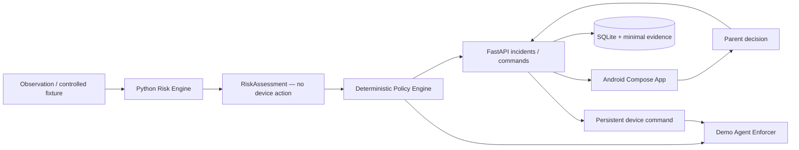

# Guardian — Android Mobile Port

Guardian is a contextual digital-safety and digital-literacy MVP for children and teenagers. It interprets recent activity, evaluates contextual risk, applies deterministic family policy, stores minimal evidence, and leaves the final unlock decision to a parent or guardian.

> **This branch is the Android mobile port.**
>
> - `main` remains the original desktop/web Guardian MVP.
> - `agent/android-mobile-port` contains the native Android interface and the shared Guardian backend required by the mobile demo.
> - Mobile-specific work should remain on this branch instead of being merged into `main` unless that decision changes later.

The reproducible vertical slice is still:

```text
conversation fixture → risk assessment → family policy → simulated block
→ incident → child explanation → parent decision → unlock command
```

The main architectural change is the client: the product-facing interface is now a **native Android application built with Kotlin and Jetpack Compose**. The Python/FastAPI backend remains the source of truth for risk classification, family policy, incidents, evidence, telemetry, and device commands.

The Android application does **not** use a WebView and does **not** duplicate the safety decision engine in Kotlin.

---

## What the mobile branch implements

### Native Android experience

- Parent dashboard with daily usage and incident metrics.
- Incident list and incident-detail review.
- Parent actions to **unlock** or **keep blocked**.
- Child transparency view with daily app-use aggregation.
- Family policy editor for `ALLOW`, `ALERT`, and `BLOCK` actions.
- Guardian API connection settings.
- Android device pairing through `POST /api/devices/pair`.
- Capability-aware UI so the app does not imply features the backend has not enabled.
- Android-specific CI that builds the debug APK.

### Shared Guardian backend

- Contextual deterministic risk engine.
- Controlled fixtures for dangerous contact, adult content, hate speech, and safe biology content.
- Deterministic Policy Engine; the risk classifier never directly chooses a device action.
- FastAPI API with SQLite persistence.
- Incident deduplication.
- Minimal evidence storage with a 4 MB upload limit.
- Device command queue and acknowledgements.
- Daily telemetry and reports.
- Release gates for automatic or real enforcement.
- Existing browser UI retained as a development/debug interface.

### Deliberately not implemented on Android yet

The Android port currently requests only the `INTERNET` permission. It does **not** request or implement:

- Accessibility Service access.
- MediaProjection / continuous screen capture.
- Microphone access.
- Camera access.
- Notification Listener access.
- Device Administrator / Device Owner capabilities.
- Real Android application blocking.

This is intentional. The original Guardian MVP is simulation-first, and this branch preserves that safety boundary until an Android-specific enforcement model, consent flow, permission model, threat model, and release gate are defined.

---

## Architecture



The platform boundary is deliberate:

```text
Android UI / device integration
            ↓
        Guardian API
            ↓
shared Python risk + policy logic
```

Keeping risk and family-policy evaluation on the shared backend avoids two independent implementations making different safety decisions.

### Repository layout on this branch

```text
guardian/
├── android-app/      native Kotlin + Jetpack Compose application
├── agent/            demo agent, API client, observer and enforcer
├── api/              FastAPI application and SQLite persistence
├── guardian_core/    shared contracts and deterministic Policy Engine
├── risk_engine/      contextual risk evaluation
├── fixtures/         controlled reproducible demo scenarios
├── config/           environment configuration examples
├── docs/             security, privacy, release gates and ADRs
├── web/              original browser UI for development/debugging
├── tests/            backend and safety tests
├── scripts/          bootstrap, API and demo commands
├── build.gradle.kts  Android project plugin versions
└── settings.gradle.kts
```

The Android architecture decision is documented in [`docs/adr/0005-android-mobile-client.md`](docs/adr/0005-android-mobile-client.md).

---

## Android specifications

| Item | Specification |
|---|---|
| Application ID | `com.guardian.mobile` |
| Android app version | `0.1.0` (`versionCode = 1`) |
| Language | Kotlin `2.3.21` |
| UI | Jetpack Compose + Material 3 |
| Compose BOM | `2026.06.00` |
| Activity Compose | `1.10.1` |
| Android Gradle Plugin | `8.13.2` |
| Gradle used by CI | `8.13` |
| Java / JVM target | Java 17 |
| `compileSdk` | 36 |
| `targetSdk` | 36 |
| `minSdk` | 26 |
| Debug network policy | Cleartext HTTP allowed for local development |
| Release network policy | Cleartext HTTP disabled; use HTTPS |
| Android permissions | `INTERNET` only |

The debug configuration allows local HTTP specifically so an emulator or development phone can connect to the local FastAPI server. Release builds disable cleartext traffic.

---

## Dependencies

### Required for the Android app

Install either Android Studio with the required SDK components or an equivalent command-line Android toolchain.

Required:

- **JDK 17**.
- **Android SDK Platform 36**.
- Android SDK build/platform tools required by AGP.
- **Gradle 8.13** if building from the command line.

The repository currently does not include a Gradle wrapper, so command-line builds expect a compatible `gradle` executable. Android Studio can import the project and manage the Gradle integration normally.

Android runtime dependencies are declared in [`android-app/build.gradle.kts`](android-app/build.gradle.kts):

- AndroidX Activity Compose.
- Compose Foundation.
- Compose Material 3.
- Compose UI.
- Compose UI tooling preview.
- Compose UI tooling in debug builds.

### Required for the Guardian backend

- **Python 3.11+**.
- Port `8000` available locally.

Python dependencies are declared in `requirements.txt` / `pyproject.toml`, including:

- `fastapi>=0.115,<1`
- `uvicorn[standard]>=0.34,<1`
- `pydantic>=2.10,<3`
- development/test dependencies such as pytest and Ruff

### Optional development dependencies

The original browser UI remains in the branch. Its quality checks additionally use:

- Node.js 22.
- pnpm 11.

They are **not required** to run the Android demo.

### External services

The reproducible local demo requires:

- no OpenAI API key,
- no cloud account,
- no remote database,
- no external authentication service.

---

# Local Android demo

The recommended demo uses an **Android Emulator** and the existing controlled `dangerous_contact` fixture. This path requires no invasive Android permissions and is the most reproducible setup.

## 1. Check out the mobile branch

For an existing clone:

```bash
git fetch origin
git switch agent/android-mobile-port
git pull
```

Or clone the branch directly:

```bash
git clone --branch agent/android-mobile-port https://github.com/luqhe/Hackaton-OpenAI-2026.git
cd Hackaton-OpenAI-2026
```

## 2. Bootstrap the Python backend

### macOS / Linux

```bash
bash scripts/bootstrap.sh
```

### Windows PowerShell

```powershell
.\scripts\bootstrap.ps1
```

This creates `.venv` and installs the backend dependencies.

## 3. Start the Guardian API

In terminal 1:

### macOS / Linux

```bash
bash scripts/run-api.sh
```

### Windows PowerShell

```powershell
.\scripts\run-api.ps1
```

The standard development script binds the API to:

```text
http://127.0.0.1:8000
```

Useful host-side endpoints:

- Browser/debug UI: `http://127.0.0.1:8000`
- OpenAPI: `http://127.0.0.1:8000/docs`
- Health check: `http://127.0.0.1:8000/api/health`

## 4. Start an Android Emulator

Create or start an Android Virtual Device with a compatible Android system image.

The Android app defaults to:

```text
http://10.0.2.2:8000
```

`10.0.2.2` is the Android Emulator alias for the development computer's loopback interface, so it reaches the FastAPI process listening on `127.0.0.1:8000`.

No API URL change is normally necessary for the emulator demo.

## 5. Build and run the Android app

### Android Studio

1. Open the **repository root** in Android Studio.
2. Allow Gradle sync to complete.
3. Ensure Android SDK Platform 36 and JDK 17 are configured.
4. Select the `android-app` application configuration/module.
5. Select the running emulator.
6. Run the app.

### Command line

With JDK 17, Android SDK 36, and Gradle 8.13 configured:

```bash
gradle :android-app:assembleDebug
```

The debug APK is produced under:

```text
android-app/build/outputs/apk/debug/
```

You can install it with ADB, for example:

```bash
adb install -r android-app/build/outputs/apk/debug/android-app-debug.apk
```

## 6. Verify the mobile connection

Open **Conexão** in the Guardian Android app.

For an emulator, the API should be:

```text
http://10.0.2.2:8000
```

Use the connection check to confirm that the Guardian API is reachable.

The app initially uses the existing demo device ID:

```text
device-demo
```

That is the recommended setting for the canned local demo because `scripts/run-demo.sh` also targets `device-demo` by default.

The **Pair this device** action is available to exercise Android device pairing, but pairing is not required for the fixture demo and does not enable real Android enforcement.

## 7. Trigger the controlled incident

In terminal 2:

### macOS / Linux

```bash
bash scripts/run-demo.sh
```

### Windows PowerShell

```powershell
.\scripts\run-demo.ps1
```

The agent will:

1. Load `fixtures/dangerous_contact/session.json`.
2. Detect the progressive requests for personal information.
3. Produce a contextual risk assessment.
4. Apply the deterministic family policy.
5. Simulate the application block.
6. Persist an incident and minimal text evidence.
7. Wait for a parent decision.

The default script uses `--wait-for-unlock`, so terminal 2 remains active while waiting for the decision.

## 8. Review the incident on Android

In the Android app:

1. Open **Início**.
2. Refresh/reopen the dashboard if necessary.
3. Select the newly created incident.
4. Review the category, confidence, explanation, and relevant evidence.
5. Choose either:
   - **Unlock application**, or
   - **Keep blocked**.

If you unlock the application, the API creates a persistent `UNLOCK_APPLICATION` command for `device-demo`.

Terminal 2 should then print a confirmation similar to:

```text
unlocked=Guardian Demo Chat command=<id>
```

That completes the end-to-end mobile demo:

```text
fixture
  ↓
risk engine
  ↓
family policy
  ↓
incident
  ↓
Android parent review
  ↓
unlock command
  ↓
demo agent acknowledgement
```

## 9. Reset the demo

Stop the API before resetting state.

### macOS / Linux

```bash
bash scripts/reset-demo.sh
```

### Windows PowerShell

```powershell
.\scripts\reset-demo.ps1
```

The reset script removes only the local `.data/` runtime state after validating its target.

---

## Running on a physical Android device

A physical phone cannot use `10.0.2.2` to reach the development computer.

The phone and development machine must be able to reach each other over the network.

### 1. Bind FastAPI to the LAN interface

Instead of `scripts/run-api.sh`, run:

```bash
.venv/bin/python -m uvicorn api.main:app --host 0.0.0.0 --port 8000 --reload
```

On Windows:

```powershell
.\.venv\Scripts\python.exe -m uvicorn api.main:app --host 0.0.0.0 --port 8000 --reload
```

### 2. Find the development machine's LAN address

For example:

```text
192.168.1.50
```

### 3. Configure the Android app

Open **Conexão** and set:

```text
http://192.168.1.50:8000
```

Debug builds permit HTTP for this local-development case.

Make sure:

- the phone and development machine are on the same trusted network,
- the host firewall permits the connection to TCP port 8000,
- the network does not isolate wireless clients.

For anything beyond trusted local development, use HTTPS rather than exposing the development API over cleartext HTTP.

---

## Other controlled scenarios

With the API running:

### macOS / Linux

```bash
.venv/bin/python -m agent.main demo --fixture fixtures/safe_biology/session.json
.venv/bin/python -m agent.main demo --fixture fixtures/adult_content/session.json
.venv/bin/python -m agent.main demo --fixture fixtures/hate_speech/session.json
```

On Windows, replace `.venv/bin/python` with `.venv\Scripts\python.exe`.

`safe_biology` should return `SAFE` without creating an incident, demonstrating that Guardian evaluates context rather than blocking isolated sensitive terminology.

---

## Android device pairing

The mobile app can pair itself with the demo child profile through:

```http
POST /api/devices/pair
```

The returned device ID is persisted in Android `SharedPreferences`.

For the standard fixture demo, however, `scripts/run-demo.sh` uses `device-demo`. Use the **demo device** option in the app when you want the Android parent workflow and host-side demo agent to refer to the same device.

Pairing an Android device currently represents registration only; it does **not** start Android-side observation or enforcement.

---

## Backend / mobile API contract

The Android application consumes the same API that powers the original browser client.

| Method and route | Mobile use |
|---|---|
| `GET /api/health` | Connection check |
| `GET /api/capabilities` | Display only features that are actually active |
| `GET /api/devices/:id` | Device status |
| `POST /api/devices/pair` | Pair an Android device |
| `GET /api/incidents` | Parent dashboard |
| `GET /api/incidents/:id` | Incident review |
| `POST /api/incidents/:id/request-unlock` | Child explanation / review request |
| `POST /api/incidents/:id/unlock` | Parent unlock decision |
| `POST /api/incidents/:id/keep-blocked` | Parent keeps block |
| `GET /api/daily-report` | Child and parent daily summaries |
| `GET /api/children/:id/policy` | Read family policy |
| `PUT /api/children/:id/policy` | Update family policy |

The agent additionally consumes the persistent device-command endpoints:

| Method and route | Use |
|---|---|
| `GET /api/devices/:id/commands` | Poll pending commands |
| `POST /api/devices/:id/commands/:commandId/ack` | Acknowledge execution |

---

## Testing and validation

### Backend tests

```bash
# macOS / Linux
.venv/bin/python -m pytest
```

```powershell
# Windows
.\.venv\Scripts\python.exe -m pytest
```

Full backend/web development checks:

```bash
pnpm install
python scripts/validate_stage0.py
python -m ruff check .
python -m ruff format --check agent api guardian_core risk_engine scripts tests
python -m pytest
pnpm check:js
pnpm lint:js
pnpm format:check
```

### Android build validation

```bash
gradle :android-app:assembleDebug
```

The Android GitHub Actions workflow is in:

```text
.github/workflows/android.yml
```

It currently builds with:

- Ubuntu runner.
- Temurin JDK 17.
- Android SDK setup action.
- Gradle 8.13.
- `gradle :android-app:assembleDebug`.

---

## Backend configuration

Environment variables are documented in `.env.example`.

| Variable | Default | Purpose |
|---|---|---|
| `GUARDIAN_ENVIRONMENT` | `development` | Typed runtime environment |
| `GUARDIAN_API_URL` | `http://127.0.0.1:8000` | API used by the Python agent |
| `GUARDIAN_DB_PATH` | `.data/guardian.db` | Local SQLite database |
| `GUARDIAN_EVIDENCE_DIR` | `.data/evidence` | Selected incident evidence |
| `GUARDIAN_LOG_LEVEL` | `INFO` | Logging level without raw observed content |
| `GUARDIAN_AUTOMATIC_BLOCKING_ENABLED` | `true` in demo | Enables blocking within release gates |
| `GUARDIAN_REAL_ENFORCEMENT_ENABLED` | `false` | Explicit gate for the existing macOS enforcer |
| `GUARDIAN_RELEASE_GATE_APPROVED` | `false` | Required gate outside development/test |
| `GUARDIAN_BLOCKABLE_APPS` | `Guardian Demo Chat` | Allowlist for existing macOS real enforcement |

Demo data uses `child-demo` and `device-demo`. Runtime database, evidence, and agent state are stored under `.data/`, which is ignored by Git.

The Android app stores only its configured API URL and selected/paired device ID in local application preferences.

---

## Security and privacy invariants

- `RiskAssessment` contains no enforcement action.
- `SAFE` assessments cannot create safety incidents.
- Family policy deterministically converts risk into an action.
- Technical failure is fail-open: errors do not create a new block.
- Automatic blocking outside controlled local conditions is restricted by release gates.
- Real enforcement is deny-by-default and requires explicit configuration.
- Evidence accepts only PNG, JPEG, WebP, or text, with a 4 MB maximum.
- Evidence file paths are generated and validated server-side.
- Observed content is treated as untrusted data.
- The Android port collects no microphone or camera data.
- The Android port currently performs no continuous screen capture.
- Release Android builds disable cleartext HTTP.

This MVP is **not production compliance**. Real deployment for minors requires authentication, family/device authorization, encryption, retention/deletion controls, appropriate consent, LGPD/COPPA review, auditability, anti-tamper design, abuse-resistance testing, and formal false-positive evaluation.

---

## Known limitations

- The current risk engine is deterministic and fixture-oriented; a remote multimodal provider is not part of the reproducible MVP.
- Android real-time observation is not implemented.
- Android application enforcement is not implemented.
- Android device pairing does not yet create a persistent Android background agent.
- The shared command protocol currently uses polling.
- There is no authentication or tenant isolation.
- There are no push notifications or multiple-family accounts.
- The backend still contains the original browser UI for development/debugging.
- The current screen hash is cryptographic rather than perceptual.

---

## Further documentation

- [`ROADMAP.md`](ROADMAP.md) — path from MVP toward production.
- [`docs/README.md`](docs/README.md) — engineering/security documentation index.
- [`docs/adr/0005-android-mobile-client.md`](docs/adr/0005-android-mobile-client.md) — Android architecture decision.
- [`docs/security/threat-model.md`](docs/security/threat-model.md) — threat model.
- [`docs/privacy/data-map.md`](docs/privacy/data-map.md) — data map.
- [`guardian_hackathon_context.md`](guardian_hackathon_context.md) — original product and hackathon context.
